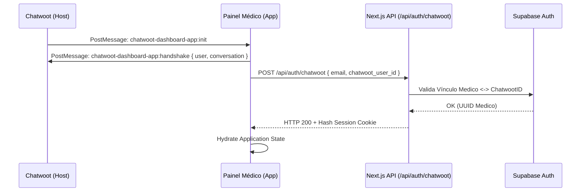

# Documentação Técnica Mestra (PRD Master) — Painel Médico

## 1. Visão Geral do Produto
O **Painel Médico** é a interface central de produtividade e conformidade para os profissionais da plataforma **DoutorTáOn**. Ele consolida fluxos clínicos (teleconsulta, prescrição), fluxos financeiros (conciliação Pix via Woovi) e fluxos fiscais (NFS-e via Nuvem Fiscal).

### 1.1. Pilares Estratégicos
- **Simplicidade**: Interface minimalista focada em redução de cliques.
- **Segurança**: Validação de certificados e-CPF/e-CNPJ e criptografia AES-256.
- **Integração**: Operação em Iframe (Dashboard App) para Chatwoot.
- **Escalabilidade**: Arquitetura baseada em Next.js Edge e Supabase RLS.

---

## 2. Arquitetura de Integração e Autenticação

### 2.1. Handshake do Chatwoot
O Painel Médico não utiliza um formulário de login tradicional quando acessado via Chatwoot. Ele utiliza um protocolo de handshake entre o `parent` (host) e o `iframe` (client).



---

## 3. Fluxos Funcionais por Módulo

### 3.1. Dashboard (Overview)
- **Header Dinâmico**: Exibe o avatar, nome, CRM e a média de avaliação (calculada via trigger no DB a partir da tabela `atendimentos`).
- **Cards de Status**:
    - `Honorários`: Soma de atendimentos com `pagamento_status = 'pago'`.
    - `Atendimentos`: Contagem de registros no mês atual.
    - `Documentos`: Contagem de PDFs emitidos.

### 3.2. Módulo de Atendimentos
Gerenciamento de fila e histórico financeiro.
- **Estados de Atendimento**:
    - `Pendente`: Agendamento criado, aguardando pagamento.
    - `Aguardando`: Pago via Woovi, aguardando o médico.
    - `Em Atendimento`: Consulta em curso.
    - `Finalizado`: Consulta concluída e documentos enviados.
- **Filtros**: Busca textual por nome do paciente e filtro por status de pagamento.
- **Paginação Dinâmica**: O hook `useDynamicPagination` monitora o `ResizeObserver` do container da tabela e calcula o número de linhas ideal para evitar scrollbars duplas dentro do Iframe.

### 3.3. Gestão de Certificados Digitais
Módulo crítico de segurança para validade jurídica de receitas e notas fiscais.

| Certificado | Uso | OID Requerido |
|-------------|-----|---------------|
| **e-CPF** | Assinatura de receitas, atestados e laudos. | `2.16.76.1.3.1` |
| **e-CNPJ** | Emissão de Notas Fiscais de Serviço (NFS-e). | `2.16.76.1.3.3` |

**Fluxo de Validação:**
1. Upload do `.pfx`.
2. Extração de metadados em Edge Runtime (instalação temporária via Buffer).
3. Verificação de senha e expiração.
4. Bloqueio de upload cruzado (impede e-CNPJ no perfil pessoal).
5. Armazenamento em Bucket Privado Supabase Storage.

---

## 4. Referência Técnica de API (19 Endpoints)

| Método | Endpoint | Função | Parâmetros/Body |
|--------|----------|--------|-----------------|
| **GET** | `/api/medico/me` | Dados do médico e média de avaliação | - |
| **PATCH** | `/api/medico/update` | Atualiza dados e chave Pix (AES-encl) | `{ nome, celular, woovi_pix_key }` |
| **GET** | `/api/atendimentos` | Listagem filtrada e paginada | `?status=...&q=...&limit=500` |
| **GET** | `/api/documentos` | Biblioteca de modelos | - |
| **POST** | `/api/documentos` | Criar novo template | `{ titulo, conteudo, tipo }` |
| **PUT** | `/api/documentos` | Editar template existente | `{ id, titulo, conteudo }` |
| **DELETE** | `/api/documentos` | Excluir template | `?id={uuid}` |
| **GET** | `/api/certificado` | Status do e-CPF atual | - |
| **POST** | `/api/certificado/upload` | Upload binário e-CPF | `FormData { file, password }` |
| **POST** | `/api/certificado/verify` | Pré-check assíncrono de tipo | `FormData { file, password }` |
| **GET** | `/api/empresa` | Dados fiscais da PJ | - |
| **PATCH** | `/api/empresa` | Atualizar dados fiscais e regime | `{ cnpj, razao_social, regime_tributario }` |
| **GET** | `/api/empresa/buscar-cnpj` | Lookup via API Nuvem Fiscal | `?cnpj={digits}` |
| **GET** | `/api/empresa/certificado` | Status do e-CNPJ atual | - |
| **POST** | `/api/empresa/certificado/upload` | Upload binário e-CNPJ | `FormData { file, password }` |
| **POST** | `/api/auth/chatwoot` | Login via Handshake (BFF) | `{ email, chatwoot_id }` |
| **POST** | `/api/auth/logout` | Encerramento de sessão | - |

---

## 5. Dicionário de Dados (Banco de Dados)

### 5.1. Tabela `medicos`
- `id`: uuid (PK, auth.uid)
- `nome`: text
- `crm`, `uf_crm`: text
- `chatwoot_user_id`: bigint (Link para o Agente)
- `woovi_pix_key`: text (Encriptada)
- `media_avaliacao`: numeric (Default 5.0)

### 5.2. Tabela `atendimentos`
- `id`: uuid (PK)
- `paciente_id`: uuid (FK)
- `medico_id`: uuid (FK)
- `status`: text (pendente, aguardando, em_atendimento, finalizado)
- `pagamento_status`: text (pago, pendente, cancelado)
- `valor_consulta`: int4 (Valores em centavos)
- `nota_fiscal_medico_url`: text (Link PDF da nota)

### 5.3. Tabela `certificados_digitais`
- `id`: uuid (PK)
- `medico_id`: uuid (FK)
- `storage_path`: text (Path no bucket)
- `validade_ate`: date
- `tipo`: text (e-cpf, e-cnpj)
- `dados_certificado`: jsonb (Razão/CNPF, Emissor)

### 5.4. Tabela `auditoria_acoes` (Proposta/Roadmap)
- `id`: uuid
- `medico_id`: uuid
- `acao`: text (ex: 'PIX_CHANGE')
- `dados_anteriores/novos`: jsonb
- `created_at`: timestamptz

---

## 6. Segurança e Conformidade

### 6.1. Políticas de RLS (Row Level Security)
Implementação de isolamento multitenant ao nível do banco de dados.

```sql
-- Exemplo de Política RLS para Atendimentos
CREATE POLICY "Medicos apenas acessam seus atendimentos"
ON public.atendimentos
FOR ALL
USING (medico_id = auth.uid())
WITH CHECK (medico_id = auth.uid());
```

### 6.2. Criptografia de Dados Bancários
A `woovi_pix_key` nunca é armazenada em texto plano.
- **Algoritmo**: AES-256-GCM.
- **Processo**: A chave mestre reside nas variáveis de ambiente (`ENCRYPTION_KEY`). O IV (Initialization Vector) é rotacionado.

---

## 7. Desenvolvimento Front-end e UX

### 7.1. Design System
- **Fonte**: Outfit (Base 16px).
- **Componentes**: Radix UI (Unstyled) + Tailwind CSS 4.
- **Tokens Semânticos**:
    - `Primary`: `#2d68c4` (Medical Blue)
    - `Success`: `#10b981` (Pago/Ativo)
    - `Warning`: `#f59e0b` (Pendente)
    - `Error`: `#ef4444` (Crítico/Cancelado)

### 7.2. Lógica de PWA e Offline (Roadmap)
- **Service Workers**: Estratégia de Cache-first para assets estáticos.
- **Offline Mode**: Cache local via IndexedDB para listagem de atendimentos recente.

---

## 8. Guia de Ambiente e Deployment

### 8.1. Variáveis de Ambiente Necessárias
```bash
NEXT_PUBLIC_SUPABASE_URL=...
NEXT_PUBLIC_SUPABASE_ANON_KEY=...
SUPABASE_SERVICE_ROLE_KEY=...
ENCRYPTION_KEY=... # Chave de 32 bytes para AES-256
NEXT_PUBLIC_SENTRY_DSN=...
WOOVI_API_KEY=...
NUVEM_FISCAL_CLIENT_ID=...
```

### 8.2. Pipeline CI/CD (Vercel)
- **Push para `main`**: Deploy Production.
- **Push para `develop`**: Deploy Staging.
- **Preview Deployments**: Gerados em cada Pull Request para validação visual.

---

## 9. Glossário de Erros Comuns
- **ERR_INVALID_OID**: Tentativa de upload de e-CNPJ no perfil pessoal.
- **ERR_CHATWOOT_HANDSHAKE**: Falha na comunicação PostMessage (geralmente CORS ou Iframe bloqueado).
- **ERR_CERT_EXPIRED**: Certificado com data de validade vencida.
